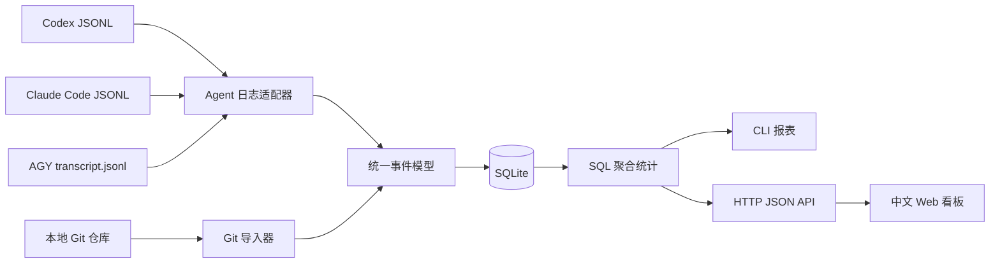

# AgentStat 当前实现架构与数据原理

> 文档状态：与 2026-08-07 当前代码实现保持一致。  
> 适用范围：Codex、Claude Code、AGY/Antigravity、本地 Git、CLI 和 Web 看板。  
> 说明：本文描述已经落地的行为，不包含早期设计稿中的规划功能。

## 1. 项目定位

AgentStat 是一个本地 AI Agent 使用分析工具，核心目标是从 Agent 已经保存在本机的会话日志中提取真实事件，并统一统计：

- 会话和项目
- 真实模型名称
- 输入、缓存读取、缓存写入、输出和推理 Token
- 普通工具、MCP 和 Skill 调用
- Agent 成功应用的代码变更
- Git 提交与精确代码行采纳率
- 用户显式配置价格后的估算费用

它不代理模型请求，不修改 Agent，不要求 Agent SDK 接入，也不把数据上传到远端。

## 2. 总体架构



整个程序可以分成五层：

| 层次 | 职责 | 主要文件 |
|---|---|---|
| CLI 调度层 | 解析命令、选择同步器或报表 | `src/cli.c`、`src/ui.c` |
| Agent 适配层 | 解析不同 Agent 的日志格式 | `src/importer.c`、`src/claude_importer.c`、`src/antigravity_importer.c` |
| 统一数据层 | 会话、Token、工具、代码变更等标准结构 | `include/agentstat.h`、`src/adapter_utils.c` |
| 存储与统计层 | SQLite 建表、迁移和聚合查询 | `src/storage.c` |
| 展示层 | HTTP API 与静态中文页面 | `src/server.c`、`web/index.html` |

## 3. 为什么使用 SQLite

AgentStat 面向单机开发者，SQLite 比 MySQL 更符合当前场景：

- 无需安装和维护数据库服务
- 所有数据保存在 `~/.agentstat/agentstat.db`
- 支持事务、主键、索引、外键和聚合查询
- WAL 模式允许读取统计时继续写入数据
- 数据库文件可以直接备份、检查和迁移

可以用 `AGENTSTAT_DATA_DIR` 修改存储目录：

```bash
AGENTSTAT_DATA_DIR=/custom/data ./agentstat summary
```

MySQL 只有在多人共享、集中采集、权限隔离或数据量明显超过单机能力时才有引入价值。

## 4. 数据采集原理

### 4.1 默认数据来源

| Agent | 默认目录 | 会话 | Token | 工具 | MCP | Skill | 代码变更 |
|---|---|---:|---:|---:|---:|---:|---:|
| Codex | `~/.codex/sessions` | 支持 | 支持 | 支持 | 支持 | 日志未提供统一 Skill 字段 | 支持 |
| Claude Code | `~/.claude/projects` | 支持 | 支持 | 支持 | 支持 | 支持 | 支持 |
| AGY/Antigravity | `~/.gemini/antigravity-cli` | 支持 | 暂无稳定真实字段 | 支持 | 支持 | 日志未提供统一 Skill 字段 | 支持 |

目录可以通过环境变量覆盖：

```bash
AGENTSTAT_CODEX_DIR=/custom/codex \
AGENTSTAT_CLAUDE_DIR=/custom/claude \
AGENTSTAT_ANTIGRAVITY_DIR=/custom/agy \
./agentstat sync
```

### 4.2 Codex

Codex 导入器逐行读取 rollout JSONL，并按事件类型处理：

- `session_meta`：会话 ID、工作目录、开始时间和模型提供方
- `turn_context`：当前真实模型名
- `event_msg/token_count`：本次 Token 使用量
- `response_item/function_call`：普通工具调用
- `response_item/mcp_tool_call`：MCP 调用
- `event_msg/patch_apply_end`：成功应用的代码变更

Codex 日志可能连续写入相同的累计 Token 快照。导入器会比较六类累计 Token 字段，跳过完全相同的相邻快照，实际入库使用 `last_token_usage`，避免将累计值重复相加。

### 4.3 Claude Code

Claude 导入器主要读取：

- `message.id`：模型调用去重
- `message.model`：真实模型名
- `message.usage`：Token 和缓存数据
- `message.content[].tool_use`：工具调用
- `tool_use.input.skill`：Skill 名称
- `tool_result`：判断 Edit、Write、MultiEdit 是否成功

Claude 输入 Token 的统一口径为：

```text
总输入 Token = 普通输入 + 缓存读取 + 缓存写入
```

只有成功完成的编辑工具才计入代码变更。失败、取消或没有成功结果的工具调用可以计入工具使用，但不会计入已应用代码。

### 4.4 AGY/Antigravity

AGY 导入器递归查找 `transcript.jsonl`，主要解析：

- `PLANNER_RESPONSE`：计划执行的工具调用
- `CODE_ACTION` 且状态为 `DONE`：确认代码动作成功
- 设置变更消息：提取用户真实选择的模型

支持的代码动作包括：

- `replace_file_content`
- `multi_replace_file_content`
- `write_to_file`

AGY 的 planner 先描述动作，后续 `CODE_ACTION` 才确认结果，因此 AgentStat 会暂存 planner 内容，只有收到成功状态才记录代码变更。

AGY 当前日志没有稳定、完整的 Token 消耗字段。此时 AgentStat 只展示模型选择次数，不把选择次数伪装成模型调用，也不会猜 Token。

## 5. 统一数据模型

### 5.1 核心事件表

| 表 | 主键或唯一标识 | 内容 |
|---|---|---|
| `sessions` | `session_id` | Agent 来源、日志路径、cwd、开始时间 |
| `model_usage_events` | `source_path + line_number` | 模型调用和各类 Token |
| `model_selection_events` | `source_path + line_number` | 模型选择或切换 |
| `tool_calls` | `source_path + line_number` | 工具名、MCP 标记、Skill 详情 |
| `code_changes` | `source_path + line_number + file_path` | 文件、分类、增删行数 |
| `model_pricing` | `source + model` | 用户配置的精确价格 |

### 5.2 Git 与归因表

| 表 | 内容 |
|---|---|
| `git_repositories` | 已同步的规范化仓库路径 |
| `git_commits` | commit hash、作者和时间 |
| `git_commit_files` | 每个提交文件的增删行数 |
| `agent_line_fingerprints` | Agent 新增非空行的 SHA-256 指纹 |
| `git_line_fingerprints` | Git 提交新增非空行的 SHA-256 指纹 |

源码正文只在导入时于内存中处理，数据库保存路径、统计值和不可逆行指纹，不保存完整对话、推理正文或源码 diff。

## 6. 幂等同步与事务

AgentStat 允许反复执行相同同步命令：

```bash
./agentstat sync
./agentstat sync-claude
./agentstat sync-codex
./agentstat sync-antigravity
```

幂等性主要依赖：

1. 使用规范化日志绝对路径作为 `source_path`。
2. 使用日志行号或稳定的派生事件序号定位事件。
3. 使用 SQLite 主键和 `INSERT OR IGNORE` 阻止重复记录。
4. 每个日志文件在事务中导入，失败时整体回滚。
5. Skill 名称只在旧记录为空、新日志明确提供名称时回填。

因此，重复同步不会重复累计 Token、工具和代码变更。

## 7. 项目识别原理

项目统计不是根据模型内容推测，而是根据本地路径识别：

1. 优先使用会话日志中的 `cwd`。
2. `cwd` 为空时，选择该会话的真实代码文件路径。
3. 从路径向上查找项目标志。
4. 找不到标志时，对常见工作区结构提取项目根目录。
5. 无法证明归属时统一归入“未识别项目”。

识别的项目标志包括：

```text
.git
package.json
Makefile
go.mod
Cargo.toml
pyproject.toml
pom.xml
build.gradle
composer.json
```

AGY 的 `.gemini/antigravity-cli/brain` 和 `scratch` 属于 Agent 内部工作目录，不会作为业务项目。若同一会话既修改了内部文件又修改了真实项目文件，优先使用真实项目文件。

项目表中的指标含义：

- 会话：识别到该项目的 Session 数
- Agent 数：参与该项目的不同 Agent 来源数
- Token：这些会话中的真实模型 Token 合计
- 工具：这些会话中的工具调用合计
- 代码变更：成功应用的独立代码变更事件数

## 8. 模型、MCP 和 Skill

### 8.1 模型

模型名始终来自 Agent 原始日志，不进行别名替换或推断。

`model_calls` 表示存在真实 usage 事件的模型调用次数；`selections` 表示用户选择该模型的次数。二者不能混用，例如 AGY 可以有模型选择，但没有可核验 Token 时模型调用数仍为 0。

### 8.2 MCP

只有日志明确标记为 MCP，或工具名符合以下格式时才计入 MCP：

```text
mcp__ServerName__toolName
```

例如：

```text
mcp__Cooper__readContent
```

解析结果为 Server `Cooper`、工具 `readContent`。非标准但明确标记为 MCP 的名称会放到“未识别 Server”，不会猜测 Server。

### 8.3 Skill

当前 Skill 统计来源于 Claude `tool_name = 'Skill'` 的调用，Skill 名称读取 `input.skill`。

旧数据重新执行 `./agentstat sync-claude` 后可以回填名称。日志没有提供名称时显示“未识别 Skill”。

## 9. 费用计算

AgentStat 不内置默认价格，也不对模型名做模糊匹配。价格必须由用户按以下组合显式配置：

```text
Agent source + 完整模型名
```

配置示例：

```bash
./agentstat pricing set \
  --source claude \
  --model claude-opus-4-8 \
  --input <普通输入费率> \
  --cache-read <缓存读取费率> \
  --cache-write <缓存写入费率> \
  --output <输出费率>
```

费率单位统一为 USD / 百万 Token。查看已有配置：

```bash
./agentstat pricing list
```

计算公式：

```text
普通输入 Token = max(总输入 - 缓存读取 - 缓存写入, 0)

估算费用 = (
    普通输入 Token * 普通输入费率
  + 缓存读取 Token * 缓存读取费率
  + 缓存写入 Token * 缓存写入费率
  + 输出 Token * 输出费率
) / 1,000,000
```

页面同时展示已配置价格覆盖的模型调用数。未配置模型不参与费用合计，并显示“未配置”，而不是显示虚假的 0 美元费用。

## 10. 代码变更与文件分类

AgentStat 统计的是 Agent 工具已经成功应用的修改，不是模型回复中出现的代码块。

文件根据路径和扩展名分成：

| 分类 | 示例规则 |
|---|---|
| `generated` | `node_modules`、`dist`、`build`、lock、min.js |
| `test` | `test`、`tests`、`__tests__`、`.spec.*`、`.test.*` |
| `documentation` | Markdown、RST、TXT、`docs` |
| `business` | C、Go、Rust、Java、Python、JS、TS、Vue、CSS、SQL 等源码 |
| `other` | 无法归入上述类型的文件 |

“代码变更数”和“新增行数”不同：一次 patch 可以修改多个文件，也可以增加或删除多行。

## 11. Git 精确行归因

Git 同步通过本地 `git` 子进程读取：

- 仓库根目录
- commit hash、作者、提交时间
- 每个文件的新增和删除行数
- Git diff 中的新增非空行

Agent 与 Git 两侧对新增非空行执行 SHA-256，归因匹配要求：

```text
同一仓库 + 同一文件路径 + 相同行内容指纹
```

重复行按两侧出现次数的较小值计算，生成文件默认排除。最终指标为：

```text
精确采纳率 = Git 中匹配的 Agent 行数 / Agent 候选行数 * 100%
```

这是保守的文本级指标：

- 原样保留的代码可以被识别。
- 被重构、格式化或改写的代码不会匹配。
- 指标不表示语义贡献，也不能证明因果关系。

## 12. CLI、API 与 Web 看板

### 12.1 CLI

主要命令：

```bash
./agentstat sync
./agentstat summary
./agentstat usage
./agentstat code
./agentstat chart
./agentstat list
./agentstat sync-git /path/to/repo
./agentstat git-stats
./agentstat attribution
./agentstat pricing list
./agentstat web --port 8080
```

`record` 和 `seed` 属于历史兼容功能。真实 Web 看板查询统一事件表，不会把 seed 数据混入真实 Agent 指标。

### 12.2 HTTP API

内嵌 C HTTP 服务提供：

| API | 数据 |
|---|---|
| `/api/summary` | 总览、费用和价格覆盖率 |
| `/api/usage` | Token、缓存、工具和 Agent 来源 |
| `/api/models` | 真实模型、调用、选择、Token 和费用 |
| `/api/projects` | 项目维度统计 |
| `/api/mcp` | MCP Server 和工具调用 |
| `/api/skills` | Skill 调用 |
| `/api/code` | Agent 成功应用的代码变更 |
| `/api/git` | Git 提交统计 |
| `/api/attribution` | 精确行采纳率 |
| `/api/sessions` | 最近会话 |

### 12.3 Web

Web 页面是无框架、无外部依赖的静态 HTML/CSS/JavaScript。页面并行请求所有 JSON API，并在浏览器中渲染表格和指标。

页面不会读取 Agent 日志，所有数据都来自 SQLite 聚合接口。

## 13. 实时性边界

当前实现是“增量同步 + 实时查询”，不是后台持续监听：

```text
Agent 写入日志 -> 执行 agentstat sync -> SQLite 更新 -> 页面刷新
```

- Web 刷新会立即读取 SQLite 当前数据。
- 新产生的 Agent 日志需要再次运行 `sync` 才会进入数据库。
- 当前没有文件系统 watcher、常驻同步服务或 WebSocket 推送。

要实现真正实时统计，可以在现有导入器上增加后台 watcher 或定时同步；SQLite 和 Web API 层无需重写。

## 14. 如何支持新的 Agent

系统与具体 Agent 不强绑定。新增 Agent 的关键是编写一个适配器，将其日志映射到统一事件表。

推荐步骤：

1. 确认 Agent 日志默认目录、文件格式和稳定事件 ID。
2. 提取会话 ID、cwd、时间和真实模型字段。
3. 明确 Token 是单次值还是累计快照。
4. 区分工具计划、执行成功和执行失败。
5. 只记录成功应用的代码变更。
6. 使用 `source_path + event_number` 保证幂等。
7. 在 `sync` 命令中加入自动发现逻辑。
8. 用重复同步、异常日志和空字段测试数据口径。

适配器不应该：

- 根据目录名猜模型。
- 将模型选择次数当成模型调用次数。
- 将累计 Token 快照直接相加。
- 将工具计划当成成功代码修改。
- 为没有日志证据的 MCP、Skill 或费用制造默认值。

## 15. 数据可信度与已知限制

### 已保证

- 模型名来自原始日志。
- Token 只来自明确的 usage 字段。
- 重复同步不会重复插入事件。
- 费用只使用精确价格配置。
- MCP 和 Skill 不依赖 mock 数据。
- 代码采纳率使用相同路径和相同行内容指纹。

### 当前限制

- AGY 暂无稳定 Token 统计。
- 项目识别依赖 cwd、文件路径和本地项目标志，部分会话只能归为“未识别项目”。
- Skill 详情目前主要来自 Claude 日志。
- 精确行归因无法识别语义相同但文本已经改写的代码。
- HTTP 服务是轻量本地服务，没有认证、TLS、分页和并发工作线程，不应直接暴露到不可信网络。
- 当前没有后台实时同步。

## 16. 验证与排查

### 编译和基础检查

```bash
make
./agentstat sync
./agentstat summary
./agentstat pricing list
```

### SQLite 对账

```bash
sqlite3 ~/.agentstat/agentstat.db \
  "SELECT source, model, COUNT(*) FROM model_usage_events u JOIN sessions s USING(session_id) GROUP BY source, model;"

sqlite3 ~/.agentstat/agentstat.db \
  "SELECT tool_name, detail_name, COUNT(*) FROM tool_calls GROUP BY tool_name, detail_name ORDER BY COUNT(*) DESC;"
```

### 数据库完整性

```bash
sqlite3 ~/.agentstat/agentstat.db "PRAGMA integrity_check; PRAGMA foreign_key_check;"
```

`integrity_check` 正常应返回 `ok`，`foreign_key_check` 正常应无输出。

